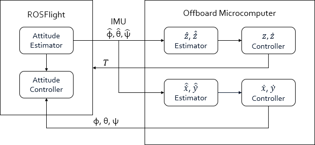

# REEF Estimator
The REEF Estimator package contains a set of simple, easy to implement, ROS-based estimators designed to supplement high-level UAV control and navigation. This includes an X/Y velocity estimator and a Z velocity and altitude estimator. For details on the theory behind the estimator design, please see the included [documentation](./docs/Estimator_Theory.pdf).

## ROSFlight Integration
REEF Estimator was originally intended to integrate nicely with the [ROSFlight](https://rosflight.org/) flight control platform, although it can be modified to work with any flight controller that provides real-time attitude estimates and control. The ROSFlight controller runs independently on a [Flip32](http://www.readytoflyquads.com/the-flip32) board (microcontroller + IMU) while REEF Estimator runs within the ROS environment on an offboard microcomputer connected via USB. An overview of this implementation is shown below:



REEF Estimator interfaces with ROSFlight by receiving attitude estimates and sending attitude and thrust commands over the USB interface. It also includes an optional RC interface that allows the user to toggle motion capture feedback in place of onboard sensors using the RC transmitter.

## Sensors
The X/Y velocity estimator fuses attitude estimates and sensor data from the ROSFlight IMU and an RGBD camera such as the [Astra Pro](https://orbbec3d.com/product-astra-pro/). If an RGBD camera is unavailable, motion capture data can be substituted using the mocap_to_velocity package (see Installation).

The Z velocity and altitude estimator fuses ROSFlight attitude estimates and sensor data with sonic altimeter ([MaxBotix MB1242](https://www.maxbotix.com/Ultrasonic_Sensors/MB1242.htm)) measurements, which can also be substituted with motion capture data.

## Code Structure
REEF Estimator is built upon the **Estimator** class, which implements a standard Kalman filter with propagate() and update() member functions which operate on the **xHat** and **z** vectors as well as the **F**, **B**, **G**, **H**, **P**, **Q**, **R**, and **K** matrices (see [https://en.wikipedia.org/wiki/Kalman_filter](https://en.wikipedia.org/wiki/Kalman_filter)). The partialUpdate() member function is also included (see [Partial Update Paper](./docs/Partial_Update.pdf)). The **XYEstimator** and **ZEstimator** classes extend the **Estimator** class and tailor it to their respective use cases by setting vector and matrix dimensions in their constructors. **XYEstimator** also implements a nonlinearPropagation() function for extended Kalman filter (EKF) functionality. The **XYZEstimator** class instantiates **XYEstimator** and **ZEstimator** objects and handles data flow, outlier rejection, and propagation/update events. Finally, the **SensorManager** class instantiates an **XYZEstimator** object and handles high-level sensor and motion capture callbacks.


**REEF Estimator code structure diagram**

## Implementation
### Prerequisites
Use the following guides to install the ROS Kinetic environment and the ROSFlight package before installing REEF Estimator:

 - [ROS Kinetic](http://wiki.ros.org/kinetic/Installation)
 - [ROSFlight](http://docs.rosflight.org/en/latest/user-guide/ros-setup/)
 
### Installation
REEF Estimator utilizes the **uncc_rgbd_odom**, **delta_to_velocity** (for RGBD camera) and **mocap_to_velocity** (for motion capture) packages for differentiating real-time pose (or delta pose) measurements into velocity estimates. In your catkin workspace **src** directory, clone the reef_estimator and supporting packages, then compile them to make sure everything builds correctly:

```
cd catkin_ws/src
git clone http://192.168.1.101/AVL-Summer-18/reef_estimator
git clone http://192.168.1.101/AVL-Summer-18/uncc_rgbd_odom
git clone http://192.168.1.101/AVL-Summer-18/delta_to_velocity
git clone http://192.168.1.101/AVL-Summer-18/mocap_to_velocity
cd ../ && catkin_make
```
   
### Usage
REEF Estimator should be executed as a node using a ROS launchfile, with **reef_estimator** being the name of the node, the package, and the type. For example,

```xml
<node name="reef_estimator" pkg="reef_estimator" type="reef_estimator" output="screen"/>
```

However, for it to work properly, several parameters will need to be included, namely those for the X/Y and Z filter matrices. It is recommended to separate these parameters into 2 .yaml files in the **reef_estimator/params** folder - **xy_est_params.yaml** and **z_est_params.yaml**. Examples of these files and descriptions of their parameters are included:

**xy_est_params.yaml**:
```
{
xy_P0: [
  0.025, 0,     0,    0,    0,    0,
  0,     0.025, 0,    0,    0,    0,
  0,     0,     0.09, 0,    0,    0,
  0,     0,     0,    0.09, 0,    0,
  0,     0,     0,    0,    0.09, 0,
  0,     0,     0,    0,    0,    0.09
],
xy_Q: [
  0.01, 0,    0,    0,    0,    0,
  0,    0.01, 0,    0,    0,    0,
  0,    0,    0.01, 0,    0,    0,
  0,    0,    0,    0.01, 0,    0,
  0,    0,    0,    0,    0.01, 0,
  0,    0,    0,    0,    0,    0.01
],
xy_R0: [
  0.01, 0,
  0,    0.01
],
xy_x0: [0, 0, 0, 0, 0, 0],
xy_beta: [1.0, 1.0, 0.3, 0.3, 0.3, 0.3]
}
```
 - **xy_P0**: Initial P (covariance) 6x6 matrix
 - **xy_Q**: Q (process noise) 6x6 matrix
 - **xy_R0**: Initial R (measurement noise) 4x4 matrix
 - **xy_x0**: Initial state estimate vector (x velocity, y velocity, roll bias, pitch bias, x accelerometer bias, y accelerometer bias)
 - **xy_beta**: Beta vector - contains the partial update weighting for each state (0 = 0% of the update, 1.0 = 100% of the update)

**z_est_params.yaml**:
```
{
z_P0: [0.025, 0,   0,
	   0,     1.0, 0,
	   0,     0,   0.09],
z_P0_flying: [0.25, 0, 0,
			  0,    1, 0,
			  0,    0, 0.09],
z_Q: [0.03, 0.001],
z_R0: [0.04],
z_R_flying: [0.0016],
z_x0: [-0.25, 0, 0],
z_beta: [1.0, 1.0, 0.5]
}
```
 - **z_P0**: Initial P 3x3 matrix while landed
 - **z_P0_flying**: Initial P 3x3 matrix while flying
 - **z_Q**: Q 2x1 matrix
 - **z_R0**: R (scalar) while landed
 - **z_R_flying**: R while flying
 - **z_x0**: Initial state estimate vector (altitude, z velocity, z accelerometer bias)
 - **z_beta**: Beta vector

**Additional parameters:**

|Name|Type|Description|Default|
|--|--|--|--|
|**enable_xy**|boolean|Enables the X/Y velocity estimator.|true|
|**enable_z**|boolean|Enables the Z velocity estimator.|true|
|**enable_rgbd**|boolean|Enables RGBD camera velocity feedback.|true|
|**enable_sonar**|boolean|enables sonar altitude feedback.|true|
|**enable_mocap_xy**|boolean|enables motion capture x/y velocity feedback.|true|
|**enable_mocap_z**|boolean|enables motion capture altitude feedback.|true|
|**enable_mocap_switch**|boolean|enables motion capture override RC switch.|false|
|**mocap_override_channel**|integer|Sets the motion capture override RC channel. If **enable_mocap_switch** is set to true, this RC channel will trigger motion capture override if the raw RC value exceeds 1500.|4|
|**mocap_twist_topic**|string|ROS topic name containing motion capture velocity geometry_msgs::TwistWithCovarianceStamped messages for X/Y velocity feedback.|mocap_velocity/body_level_frame|
|**mocap_pose_topic**|string|ROS topic name containing motion capture geometry_msgs::PoseStamped messages for altitude feedback.|mocap_ned|
|**rgbd_twist_topic**|string|ROS topic name containing RGBD velocity geometry_msgs::TwistWithCovarianceStamped messages for X/Y velocity feedback|rgbd_velocity_body_frame|
|**estimator_dt**|double|Timestep in seconds for estimator propagation (period of published IMU messages)|0.002|
|**debug_mode**|boolean|Enables debugging mode which prints more information to the console and publishes the xyz_debug_estimate topic (see ROS Topics and Messages) containing covariance and z-minus states.|false|

A characteristic **reef_estimator** launchfile node declaration is included for reference:
```xml
<node name="reef_estimator" pkg="reef_estimator" type="reef_estimator" output="screen">
	<rosparam file="$(find reef_estimator)/params/xy_est_params.yaml" />
	<rosparam file="$(find reef_estimator)/params/z_est_params.yaml" />
	<rosparam subst_value="true">
		enable_rgbd: true
		enable_sonar: true
		enable_mocap_xy: true
		enable_mocap_z: true

		enable_mocap_switch: true
		mocap_override_channel: 4

		debug_mode: true
	</rosparam>
</node>
```
REEF Estimator also requires several supporting nodes if RGBD or motion capture velocity measurements will be included. Firstly, the **rosflight_io** node should be included:
```xml
<node name="rosflight" pkg="rosflight" type="rosflight_io" output="screen">
	<param name="port" value="/dev/ttyUSB0"/>
</node>
```

For OptiTrack motion capture systems, the **ros_vrpn_client** node should be included:
```xml
<node pkg="ros_vrpn_client" name="$(arg vehicle_name)" type="ros_vrpn_client" args="_vrpn_server_ip:=192.168.1.104" required="true" output="screen">
	<remap from="$(arg vehicle_name)/ned/pose_stamped" to="mocap_ned"/>
</node>
```
As shown, the vehicle geometry_msgs::PoseStamped topic name should be remapped to the name provided to the estimator via the **mocap_pose_topic** parameter. Additionally, the mocap_to_velocity node is required for motion capture velocity feedback:
```xml
<node pkg="mocap_to_velocity" name="mocap_to_velocity" type="mocap_to_velocity" output="screen">
   <remap from="pose_stamped" to="mocap_ned"/>
   <rosparam subst_value="true">
		mocap_noise_std: 0.0
	</rosparam>
</node>
```
Again, the pose topic is remapped for consistency. The **mocap_noise_std** parameter allows noise to be added to the motion capture velocity estimates for testing filter performance. This parameter takes a **double** argument representing the standard deviation of the desired noise. For RGBD velocity feedback, the **uncc_rgbd_odom** node must be launched. This produces the delta-pose odometry estimates differentiated to obtain vehicle velocity. For Astra cameras, the following launch file should be used:
```
<include file="$(find uncc_rgbd_odom)/launch/astra_rgbd.launch">
	<arg name="run_rviz" value="false"/>
</include>
```
The **run_rviz** argument prevents rviz from launching mid-flight and draining CPU bandwidth. The **delta_to_velocity** node must also be included to differentiate delta-pose for the filter:
```xml
<node name="delta_to_velocity" pkg="delta_to_velocity" type="delta_to_velocity" output="screen">
    <rosparam subst_value="true">
        sigma_multiplier : 10.0
    </rosparam>
</node>
```
The **sigma_multiplier** parameter (double precision) determines the covariance prescaling applied to the odometry estimates.

Complete estimator launchfile example:

```xml
<?xml version="1.0"?>

<launch>
    <arg name="use_mocap" value="true"/>
    <arg name="vehicle_name" value="uav1"/>
	
    <!-- rosflight_io interface -->
    <node name="rosflight" pkg="rosflight" type="rosflight_io" output="screen">
        <param name="port" value="/dev/ttyUSB0"/>
    </node>
	
    <node name="reef_estimator" pkg="reef_estimator" type="reef_estimator" output="screen">
        <rosparam file="$(find reef_estimator)/params/xy_est_params.yaml" />
        <rosparam file="$(find reef_estimator)/params/z_est_params.yaml" />
        <rosparam subst_value="true">
            enable_rgbd: true
            enable_sonar: true
            enable_mocap_xy: true
            enable_mocap_z: true

            enable_mocap_switch: true
            mocap_override_channel: 4

            debug_mode: true
        </rosparam>
    </node>
	
	<!-- RGBD -->
	<include file="$(find uncc_rgbd_odom)/launch/astra_rgbd.launch">
		<arg name="run_rviz" value="false"/>
	</include>
    <node name="delta_to_velocity" pkg="delta_to_velocity" type="delta_to_velocity" output="screen">
        <rosparam subst_value="true">
            sigma_multiplier : 10.0
        </rosparam>
    </node>

    <!-- Mocap -->
    <node if="$(arg use_mocap)" pkg="ros_vrpn_client" name="$(arg vehicle_name)" type="ros_vrpn_client" args="_vrpn_server_ip:=192.168.1.104" required="true" output="screen">
        <remap from="$(arg vehicle_name)/ned/pose_stamped" to="mocap_ned"/>
    </node>
    <node if="$(arg use_mocap)" pkg="mocap_to_velocity" name="mocap_to_velocity"  type="mocap_to_velocity" output="screen">
       <remap from="pose_stamped" to="mocap_ned"/>
       <rosparam subst_value="true">
            mocap_noise_std: 0.0
        </rosparam>
    </node>
</launch>
```

### ROS Topics and Messages

**Internal Message Types**

REEF Estimator uses 6 custom message types to store state estimates of interest and filter debugging information:

 - **XYEstimate**
	 - **x_dot**: x velocity estimate (float64)
	 - **y_dot**: y velocity estimate (float64)
	 
 - **XYDebugEstimate**
	 - **x_dot**: x velocity estimate (float64)
	 - **y_dot**: y velocity estimate (float64)
	 - **pitch_bias**: pitch attitude bias estimate (float64)
	 - **roll_bias**: roll attitude bias estimate (float64)
	 - **xa_bias**: accelerometer x bias estimate (float64)
	 - **ya_bias**: accelerometer y bias estimate (float64)
	 - **sigma_plus**: 6-vector of states plus their 3-sigmas (float64)
	 - **sigma_minus**: 6-vector of states minus their 3-sigmas (float64)
	 
 - **ZEstimate**
	 - **z**: altitude estimate (float64)
	 - **z_dot**: z velocity estimate (float64)
	 
 - **ZDebugEstimate**
	 - **z**: altitude estimate (float64)
	 - **z_dot**: z velocity estimate (float64)
	 - **bias**: accelerometer z bias estimate (float64)
	 - **u**: control input - accelerometer inertial z measurement (float64)
	 - **P**: 3x3 estimator covariance matrix (float64)
	 - **truth**: motion capture z and z_dot ground truth (if available) (float64)
	 - **z_error**: estimator altitude error (float64)
	 - **z_dot_error**: estimator z velocity error (float64)
	 - **sigma_plus**: 3-vector of states plus their 3-sigmas (float64)
	 - **sigma_minus**: 3-vector of states minus their 3-sigmas (float64)
	 
 - **XYZEstimate**
	 - **xy_plus**: XY estimator posterior states (XYEstimate)
	 - **z_plus**: Z estimator posterior states (ZEstimate)
	 
 - **XYZDebugEstimate**
	 - **xy_minus**: XY estimator prior states with covariance (XYDebugEstimate)
	 - **xy_plus**: XY estimator posterior states with covariance (XYDebugEstimate)
	 - **z_minus**: Z estimator prior states with covariance (ZDebugEstimate)
	 - **z_plus**: Z estimator posterior states with covariance (ZDebugEstimate)
	 
**Subscribed Topics**
 
|Topic Name|Message Type|Description|
|--|--|--|
|imu/data|sensor_msgs::Imu|ROSFlight IMU data|
|rc_raw|rosflight_msgs::RCRaw|ROSFlight raw RC data|
|rgbd_velocity_body_frame|geometry_msgs::TwistWithCovariance|RGBD velocity measurements|
|mocap_ned|geometry_msgs::PoseStamped|Motion capture pose measurements|
|mocap_velocity/body_level_frame|geometry_msgs::TwistWithCovariance|Motion capture velocity measurements|
|sonar|sensor_msgs::Range|ROSFlight sonar measurements|

 **Published Topics**
 
|Topic Name|Message Type|Description|
|--|--|--|
|is_flying_reef|std_msgs::Bool|Takeoff detector status (true if flying, false if landed)|
|sonar_ned|sensor_msgs::Range|ROSFlight sonar measurements republished in NED frame|
|xyz_estimate|reef_estimator::XYZEstimate|Current state estimates for controller feedback purposes|
|xyz_debug_estimate|reef_estimator::XYZDebugEstimate|Current state estimates, covariances, and additional information for filter tuning and debugging purposes|

## Demonstration
Video demonstration of a closed-loop velocity controller using REEF Estimator for feedback:

[](http://www.youtube.com/watch?v=Ep6rkRofZs4)