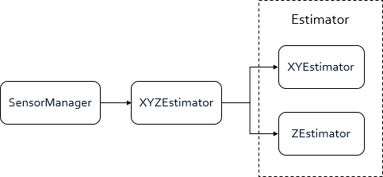
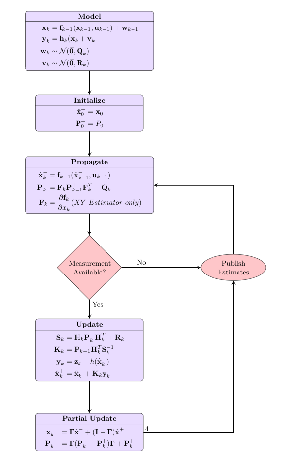

# REEF Estimator
The REEF Estimator package contains a set of simple, easy to implement, ROS-based estimators designed to supplement high-level UAV control and navigation.  This includes an X/Y velocity estimator and a Z velocity and altitude estimator.  For details on the theory behind the estimator design, please see the included [documentation](./docs/Estimator_Theory.pdf).

## Table of Contents
1. [ROSFlight Integration](#rosflight-Integration)
2. [Sensors](#sensors)
3. [Code Structure](#code-structure)
4. [Implementation](#implementation)
5. [Usage](#usage)
6. [Demonstration](#demonstration)
7. [Notes](#notes)


## ROSFlight Integration
While the REEF Estimator was originally intended to integrate nicely with the [ROSFlight](https://rosflight.org/) flight control platform, it can also be modified to work with any flight controller that provides real-time attitude estimates and control.  The ROSFlight controller runs independently on a [Flip32](http://www.readytoflyquads.com/the-flip32) board (microcontroller + IMU) while the REEF Estimator runs within the ROS environment on an offboard microcomputer connected via USB.  An overview of this implementation is shown below:


## Sensors
The X/Y velocity estimator merges attitude estimates, sensor data from the ROSFlight IMU, and images from a RGBD camera such as the [Astra Pro](https://orbbec3d.com/product-astra-pro/) to produce velocity estimates. If a RGBD camera is unavailable, motion capture data can be substituted using the mocap_to_velocity package (see Installation).

The Z velocity and altitude estimator merges ROSFlight attitude estimates and sensor data from a sonic altimeter ([MaxBotix MB1242](https://www.maxbotix.com/Ultrasonic_Sensors/MB1242.htm)), which can also be substituted with motion capture data.

## Code Structure
The REEF Estimator is built upon the **Estimator** class, which implements a standard Kalman filter with propagate() and update() member functions which operate on the **xHat** and **z** vectors as well as the **F**, **B**, **G**, **H**, **P**, **Q**, **R**, and **K** matrices (see [https://en.wikipedia.org/wiki/Kalman_filter](https://en.wikipedia.org/wiki/Kalman_filter)). The partialUpdate() member function is also included (see [Partial Update Paper](./docs/Partial_Update.pdf)). The **XYEstimator** and **ZEstimator** classes extend the **Estimator** class and tailor it to their respective use cases by setting vector and matrix dimensions in their constructors. **XYEstimator** also implements a nonlinearPropagation() function for extended Kalman filter (EKF) functionality. The **XYZEstimator** class instantiates **XYEstimator** and **ZEstimator** objects and handles data flow, outlier rejection, and propagation/update events. Finally, the **SensorManager** class instantiates an **XYZEstimator** object and handles high-level sensor and motion capture callbacks.



**REEF Estimator code structure diagram**

## Implementation
### Flowchart

### Prerequisites
Use the following guides to install the ROS Kinetic environment and the ROSFlight package before installing REEF Estimator:

 - [ROS Kinetic](http://wiki.ros.org/kinetic/Installation)
 - [ROSFlight](http://docs.rosflight.org/en/latest/user-guide/ros-setup/)
 - [REEF_msgs](http://192.168.1.101/AVL-Summer-18/reef_msgs)
 
### Dependencies 
 
 ```html
roscpp
rospy
geometry_msgs
rosflight_msgs
sensor_msgs
std_msgs
tf2_eigen
tf_conversions
reef_msgs
```
 
### Installation

```
cd catkin_ws/src
git clone http://192.168.1.101/AVL-Summer-18/reef_estimator
cd ../ && catkin_make
```
   
### Usage
The REEF Estimator should be executed as a node using a ROS launchfile, with **reef_estimator** being the name of the node, the package, and the type. For example,

```xml
<node name="reef_estimator" pkg="reef_estimator" type="reef_estimator" output="screen"/>
```

However, for it to work properly, several parameters will need to be included, namely those for the X/Y and Z filter matrices. It is recommended to separate these parameters into two .yaml files in the **reef_estimator/params** folder: **xy_est_params.yaml** and **z_est_params.yaml**. Examples of these files and descriptions of their parameters are included:

**xy_est_params.yaml**:
```
{
xy_P0: [
  0.025, 0,     0,    0,    0,    0,
  0,     0.025, 0,    0,    0,    0,
  0,     0,     0.09, 0,    0,    0,
  0,     0,     0,    0.09, 0,    0,
  0,     0,     0,    0,    0.09, 0,
  0,     0,     0,    0,    0,    0.09
],
xy_Q: [
  0.01, 0,    0,    0,    0,    0,
  0,    0.01, 0,    0,    0,    0,
  0,    0,    0.01, 0,    0,    0,
  0,    0,    0,    0.01, 0,    0,
  0,    0,    0,    0,    0.01, 0,
  0,    0,    0,    0,    0,    0.01
],
xy_R0: [
  0.01, 0,
  0,    0.01
],
xy_x0: [0, 0, 0, 0, 0, 0],
xy_beta: [1.0, 1.0, 0.3, 0.3, 0.3, 0.3]
}
```
 - **xy_P0**: Initial P (covariance) 6x6 matrix
 - **xy_Q**: Q (process noise) 6x6 matrix
 - **xy_R0**: Initial R (measurement noise) 4x4 matrix
 - **xy_x0**: Initial state estimate vector (x velocity, y velocity, roll bias, pitch bias, x accelerometer bias, y accelerometer bias)
 - **xy_beta**: Beta vector - contains the partial update weighting for each state (0 = 0% of the update, 1.0 = 100% of the update)

**z_est_params.yaml**:
```
{
z_P0: [0.025, 0,   0,
	   0,     1.0, 0,
	   0,     0,   0.09],
z_P0_flying: [0.25, 0, 0,
			  0,    1, 0,
			  0,    0, 0.09],
z_Q: [0.03, 0.001],
z_R0: [0.04],
z_R_flying: [0.0016],
z_x0: [-0.25, 0, 0],
z_beta: [1.0, 1.0, 0.5]
}
```
 - **z_P0**: Initial P 3x3 matrix while landed
 - **z_P0_flying**: Initial P 3x3 matrix while flying
 - **z_Q**: Q 2x1 matrix
 - **z_R0**: R (scalar) while landed
 - **z_R_flying**: R while flying
 - **z_x0**: Initial state estimate vector (altitude, z velocity, z accelerometer bias)
 - **z_beta**: Beta vector

**Additional parameters:**

|Name|Type|Description|Default|
|--|--|--|--|
|**enable_xy**|boolean|Enables the X/Y velocity estimator.|true|
|**enable_z**|boolean|Enables the Z velocity estimator.|true|
|**enable_rgbd**|boolean|Enables RGBD camera velocity feedback.|true|
|**enable_sonar**|boolean|enables sonar altitude feedback.|true|
|**enable_mocap_xy**|boolean|enables motion capture x/y velocity feedback.|true|
|**enable_mocap_z**|boolean|enables motion capture altitude feedback.|true|
|**enable_mocap_switch**|boolean|enables motion capture override RC switch.|false|
|**mocap_override_channel**|integer|Sets the motion capture override RC channel. If **enable_mocap_switch** is set to true, this RC channel will trigger motion capture override if the raw RC value exceeds 1500.|4|
|**mocap_twist_topic**|string|ROS topic name containing motion capture velocity geometry_msgs::TwistWithCovarianceStamped messages for X/Y velocity feedback.|mocap_velocity/body_level_frame|
|**mocap_pose_topic**|string|ROS topic name containing motion capture geometry_msgs::PoseStamped messages for altitude feedback.|mocap_ned|
|**rgbd_twist_topic**|string|ROS topic name containing RGBD velocity reef_msgs::DeltaToVel messages for X/Y velocity feedback|rgbd_velocity_body_frame|
|**estimator_dt**|double|Timestep in seconds for estimator propagation (period of published IMU messages)|0.002|
|**debug_mode**|boolean|Enables debugging mode which prints more information to the console and publishes the xyz_debug_estimate topic (see ROS Topics and Messages) containing covariance and z-minus states.|false|

A sample **reef_estimator** launchfile node declaration is included for reference:
```xml
<node name="reef_estimator" pkg="reef_estimator" type="reef_estimator" output="screen">
	<rosparam file="$(find reef_estimator)/params/xy_est_params.yaml" />
	<rosparam file="$(find reef_estimator)/params/z_est_params.yaml" />
	<rosparam subst_value="true">
		enable_rgbd: true
		enable_sonar: true
		enable_mocap_xy: true
		enable_mocap_z: true

		enable_mocap_switch: true
		mocap_override_channel: 4

		debug_mode: true
	</rosparam>
</node>
```

A few examples of launch files are given in the launch directory. If you happen to have a bag file you can use the verify_estimate.launch which will generate plots of the estimator along with the truth. For this to work you MUST have the [Plot Juggler](https://github.com/facontidavide/PlotJuggler) package.

### ROS Topics and Messages

**Internal Message Types**

The REEF Estimator uses 6 custom message types to store state estimates of interest and filter debugging information:

 - **XYEstimate**
	 - **x_dot**: x velocity estimate (float64)
	 - **y_dot**: y velocity estimate (float64)
	 
 - **XYDebugEstimate**
	 - **x_dot**: x velocity estimate (float64)
	 - **y_dot**: y velocity estimate (float64)
	 - **pitch_bias**: pitch attitude bias estimate (float64)
	 - **roll_bias**: roll attitude bias estimate (float64)
	 - **xa_bias**: accelerometer x bias estimate (float64)
	 - **ya_bias**: accelerometer y bias estimate (float64)
	 - **sigma_plus**: 6-vector of states plus their 3-sigmas (float64)
	 - **sigma_minus**: 6-vector of states minus their 3-sigmas (float64)
	 
 - **ZEstimate**
	 - **z**: altitude estimate (float64)
	 - **z_dot**: z velocity estimate (float64)
	 
 - **ZDebugEstimate**
	 - **z**: altitude estimate (float64)
	 - **z_dot**: z velocity estimate (float64)
	 - **bias**: accelerometer z bias estimate (float64)
	 - **u**: control input - accelerometer inertial z measurement (float64)
	 - **P**: 3x3 estimator covariance matrix (float64)
	 - **truth**: motion capture z and z_dot ground truth (if available) (float64)
	 - **z_error**: estimator altitude error (float64)
	 - **z_dot_error**: estimator z velocity error (float64)
	 - **sigma_plus**: 3-vector of states plus their 3-sigmas (float64)
	 - **sigma_minus**: 3-vector of states minus their 3-sigmas (float64)
	 
 - **XYZEstimate**
	 - **xy_plus**: XY estimator posterior states (XYEstimate)
	 - **z_plus**: Z estimator posterior states (ZEstimate)
	 
 - **XYZDebugEstimate**
	 - **xy_minus**: XY estimator prior states with covariance (XYDebugEstimate)
	 - **xy_plus**: XY estimator posterior states with covariance (XYDebugEstimate)
	 - **z_minus**: Z estimator prior states with covariance (ZDebugEstimate)
	 - **z_plus**: Z estimator posterior states with covariance (ZDebugEstimate)
	 
**Subscribed Topics**
 
|Topic Name|Message Type|Description|
|--|--|--|
|imu/data|sensor_msgs::Imu|ROSFlight IMU data|
|rc_raw|rosflight_msgs::RCRaw|ROSFlight raw RC data|
|rgbd_velocity_body_frame|reef_msgs::DeltaToVel|RGBD velocity measurements|
|mocap_ned|geometry_msgs::PoseStamped|Motion capture pose measurements|
|mocap_velocity/body_level_frame|geometry_msgs::TwistWithCovariance|Motion capture velocity measurements|
|sonar|sensor_msgs::Range|ROSFlight sonar measurements|

 **Published Topics**
 
|Topic Name|Message Type|Description|
|--|--|--|
|is_flying_reef|std_msgs::Bool|Takeoff detector status (true if flying, false if landed)|
|sonar_ned|sensor_msgs::Range|ROSFlight sonar measurements republished in NED frame|
|xyz_estimate|reef_estimator::XYZEstimate|Current state estimates for controller feedback purposes|
|xyz_debug_estimate|reef_estimator::XYZDebugEstimate|Current state estimates, covariances, and additional information for filter tuning and debugging purposes|

## Demonstration
Video demonstration of a closed-loop velocity controller using REEF Estimator for feedback:

[](http://www.youtube.com/watch?v=Ep6rkRofZs4)

## Notes
The estimator has a small python script to verify the estimates. This script subscribes to the following topics
- xyz_debug_estimates               [reef_msg/XYZDebugEstimate]
- mocap/velocity/body_level_frame             [geometry_msgs/TwistWithCovarianceStamped   ]
- rgbd_velocity/body_level_frame            [reef_msg/DeltaToVel  ]
- pose_stamped      [geometry_msgs/PoseStamped]

It publishes the following topics:
- sync_estimates     [reef_msg/SyncVerifyEstimates  ]
- estimate_error           [reef_msg/SyncEstimateError  ]


With this information, it produces the error and associated covariance which helps in testing if the filter is statistically consistent. 

There is also more documentation with regards to the estimator design and dynamic equations in the [/docs/](./docs) directory.